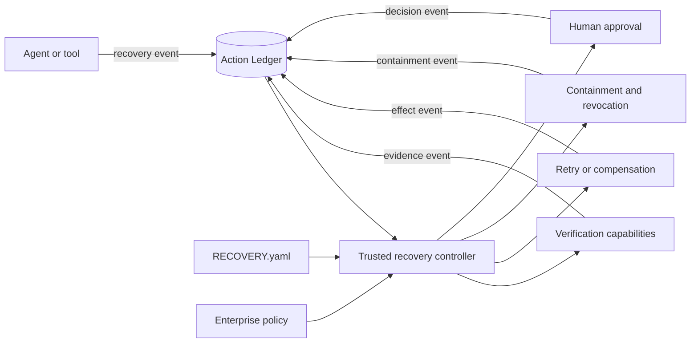

# Agent Recovery State Machine Architecture

## Thesis

Let AI reason during normal operation. When failure or uncertainty occurs, switch
to deterministic recovery mode.

A failed response does not prove that an operation failed. A successful response
does not prove that the intended outcome was achieved. Recovery therefore begins
with durable operation state and authoritative verification—not with the model's
interpretation of a response.

## System boundary



The model may explain or recommend a transition. It is not the enforcement point.
Only the trusted controller may advance the recovery state machine.

## Deterministic contract

Every transition has the form:

```text
current state + event + trusted guard evidence + policy
  -> registered actions + next state
```

- **State** records the current recovery position.
- **Event** reports an observable occurrence such as a timeout, verification
  result, compensation result, or human decision.
- **Guard** is a named, trusted predicate over ledger evidence and policy.
- **Action** is a registered capability identifier, never embedded code.
- **Transition** deterministically selects the next permitted state.

## Restricted statechart profile

The architecture borrows event, guard, transition, final-state, and parallel-state
concepts from [W3C SCXML](https://www.w3.org/TR/scxml/), but deliberately does not
accept arbitrary SCXML executable content.

A conformant Agent Recovery machine:

1. contains no scripts, expressions, credentials, or model prompts;
2. references guards and actions by registered identifier;
3. persists state and evidence outside the conversation;
4. fails closed on unknown events, guards, states, or capabilities;
5. never retries a possible side effect directly from unknown state;
6. records every event, guard decision, action result, and transition; and
7. requires an external approval event for material resumption.

## Runtime sequence

1. The agent or tool emits a recovery event with operation and correlation IDs.
2. The controller loads the pinned `RECOVERY.yaml`, Action Ledger entry, and policy.
3. The controller validates that the event is accepted by the current state.
4. It evaluates any named guard against trusted evidence.
5. It records the transition decision before invoking registered actions.
6. Action results return as new events; they do not mutate state implicitly.
7. Unknown or unsafe outcomes transition to containment and human escalation.
8. Work resumes only after the machine receives the required approval and
   verification events.

## Classifier-assisted detection

The thesis above is a two-system split: reasoning during normal operation,
determinism during recovery. A fast, bounded classification model—a "System One"
model that returns calibrated choice, score, or yes/no probabilities—can sit at
the boundary and decide *when* to cross it: flagging that an operation's effect is
possible, proposing which recovery event a raw failure signal represents, or
scoring how urgently a human should be paged.

Such a classifier is an event producer, not an enforcement point. It proposes; the
controller disposes. Its output enters as an untrusted candidate event and advisory
evidence, is recorded in the ledger, and is then validated against the current
state like any other event. It never evaluates a guard, advances a transition, or
authorizes a side effect. See [specification §11](SPEC.md).

## Why a statechart

A flat finite-state machine is enough for simple verification and retry. A
statechart also supports nested recovery phases and parallel containment—for
example stopping a task, revoking its token, and cancelling descendant work while
preserving a single auditable recovery state.

The portable file defines semantics. Implementations may map those semantics to
an existing state-machine or workflow engine without making that engine part of
the standard.
