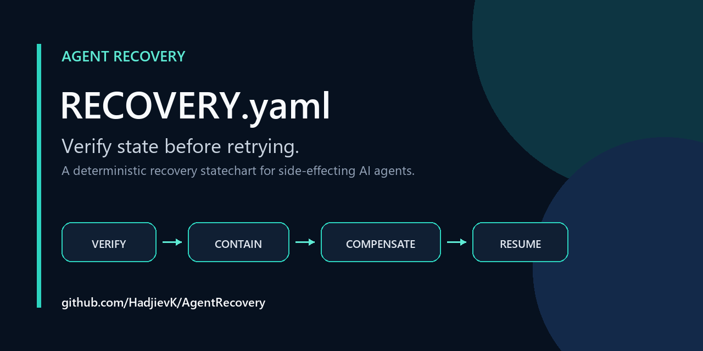
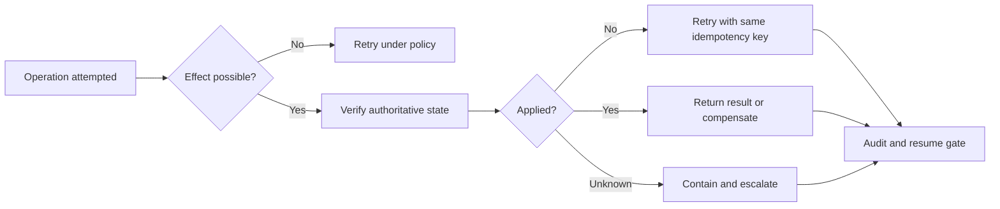

# Agent Recovery



**A portable, deterministic recovery state machine for AI agents.**

Agent Recovery proposes `RECOVERY.yaml`: a machine-readable statechart that tells a trusted recovery controller how to verify, contain, compensate for, and safely resume agent operations. An optional `RECOVERY.md` explains the plan to operators.

The project is inspired by the packaging model of the [Agent Skills open specification](https://github.com/agentskills/agentskills), while remaining focused on recovery as a separate operational concern.

Status: **Draft 0.2 - Request for Comments**

> **Let AI reason during normal operation. When failure or uncertainty occurs,
> switch to deterministic recovery mode—because a failed response does not prove
> the operation failed, and a successful response does not prove the intended
> outcome was achieved.**

**Autonomous execution. Deterministic recovery. A response is not proof of an outcome.**

## Why this exists

An agent can receive a timeout after an external operation has already succeeded. Blindly retrying can then create duplicate payments, purchase requests, emails, tickets, deployments, or access grants. A kill switch can stop the next action, but it cannot determine what already happened or repair the resulting business state.

Agent Recovery makes that missing operational contract explicit as a state machine. A recovery machine defines:

- which tools and effects it applies to;
- how downstream state is verified;
- when a retry is safe;
- which compensating action is available;
- how tasks, credentials, and downstream work are contained;
- when a human must intervene; and
- what evidence and approvals are required before resumption.

## Design principles

1. **Deterministic recovery.** States, events, guards, actions, and transitions—not model reasoning—govern recovery.
2. **Declarative, not executable by default.** Machines reference trusted capability identifiers; they do not embed arbitrary shell commands.
3. **Unknown is a real state.** A timeout is not proof that an operation failed.
4. **No blind retries after possible side effects.** Verify external state first.
5. **Recovery starts from observable operation state.** A machine does not require a particular failure taxonomy or agent framework.
6. **Stopping and revoking are separate operations.** A stopped task may leave valid tokens or delegated work behind.
7. **Recovery includes safe resumption.** The agent does not authorize its own return to service after a material incident.
8. **Human authority is risk-driven.** Irreversible, ambiguous, or high-impact recovery decisions require an accountable person.
9. **Every transition is auditable.** Recovery must be reconstructable from durable evidence, not conversational memory.

## Package layout

```text
recovery-machine-name/
├── RECOVERY.yaml     # Required: deterministic recovery statechart
├── RECOVERY.md       # Optional: operator guidance and rationale
├── tests/            # Optional: failure-injection and conformance cases
├── references/       # Optional: runbooks and system documentation
└── handlers/         # Optional: trusted, separately approved implementations
```

See the [architecture](ARCHITECTURE.md), [draft specification](SPEC.md), [conformance levels](CONFORMANCE.md), [normative state-machine schema](schema/recovery-machine.schema.json), and [procurement example](examples/procurement-request/RECOVERY.yaml).

## Recovery flow



## Try it

Validate every included recovery state machine:

```bash
python -m pip install -r requirements-dev.txt
python scripts/validate.py
```

Examples currently cover:

- [procurement request creation](examples/procurement-request/RECOVERY.yaml);
- [external email delivery](examples/email-delivery/RECOVERY.yaml); and
- [production deployment](examples/production-deployment/RECOVERY.yaml).

## Join the RFC

This is an early proposal, not an established standard. We are looking for agent
builders, platform engineers, SREs, security teams, and business-system owners to:

1. test `RECOVERY.yaml` against a real side-effecting workflow;
2. challenge the schema and recovery states;
3. contribute failure-injection cases or another domain example; and
4. discuss interoperability requirements in [GitHub Discussions](https://github.com/HadjievK/AgentRecovery/discussions).

See [CONTRIBUTING.md](CONTRIBUTING.md) and [ROADMAP.md](ROADMAP.md) to get involved.

## Security boundary

`RECOVERY.yaml` is input to a trusted controller, not an authorization grant. A conformant controller must validate the machine, resolve action and guard identifiers through administrator-controlled registries, enforce normal identity and policy checks, and reject any machine that attempts to broaden its own authority.

## Open questions

- Should the standard be named Agent Recovery State Machine or Agent Recovery Protocol?
- Which statechart semantics should form the smallest interoperable core?
- How should machines be signed, distributed, and pinned to tool versions?
- How should recovery lineage cross agent, process, and service boundaries?
- Which organization should steward capability and effect-class registries?

## License

Licensed under the [Apache License 2.0](LICENSE).
